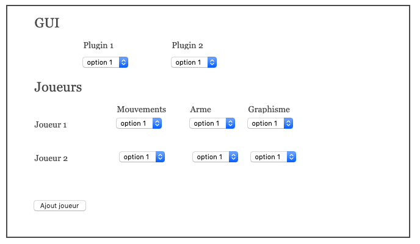

# Projet Programmation avancée 2018-2019

## Lancement 

mvn install exec:java

## Description  
Le but de ce projet est d'écrire un petit jeu utilisant l'API JavaFX pour la partie graphique et une architecture à plugins. 

### Gameplay
Une partie du jeu se déroule de la façon suivante : 
   * Un nombre variable de joueurs se déplace à l'écran 
   * Chaque joueur a une barre de vie
   * Une collision entre joueurs leur fait perdre de la vie
   * Les joueurs peuvent avoir des armes qui retirent de la vie aux adversaires
   * Le gagnant est le dernier à avoir encore de la vie
De base tous les joueurs sont controlés par l'ordinateur, sans intervention humaine

### Principe des plugins    
Le point important du projet est d'avoir une architecture à plugins. La majorité de l'application devra être configurée grâce à des classes qui seront chargées dynamiquement à l'exécution. De plus on ne souhaite pas utiliser l'héritage pour ça mais des annotations. 
Par exemple, on peut imaginer spécifier un comportement différent pour le déplacement avec la classe suivante

```java
@Mouvement
public class NimporteComment {
	@changeDirection
	public void onChange(...) {
	    ...
	}
}
```
Concrètement, le jeu devra
1. Charger la classe à l'exécution en la trouvant sur le disque et en vérifiant son annotation
1. Appeler la méthode onChange(...) qu'il aura trouvé grâce à l'annotation quand ça sera nécessaire

### Liste non exhaustive de plugins
Une fois l'architecture pour plugins mise en place, il devrait être très facile d'en ajouter. Mais il faut avoir bien prévu ce qu'on voulait faire dès le début. Voici une petite liste de plugins qui pourront être implémentés. Cette liste devrait permettre de décider quand un plugin est appelé et comment il est appelé (paramètres).
  
*  Mouvement de joueur : 
    * déplacement aléatoire
    * suivi, fuite
* Formes/Graphismes joueurs
    * Affichage de figures géométriques, images
    * Affichage barre de vie, perte de vie...
* Comportement si collisions
    * Changement d’image en cas de collision
    * Création de nouveaux sprites lors d’une collision
* Armes
	* Mine, missile à trajectoire variable...
* GUI
    * Ajout d’une barre de menu pour faire pause, redémarrer la partie...
    * Ajout d'informations tel que durée de partie, longueur des déplacements...
* Autre
    * Avoir un comportement pour les joueurs morts (par exemple ralentir les autres joueurs en cas de contact)
    * Avoir un joueur humain (pilotage au clavier)
  
  
 ### Code démo
 Le code fournit dans ce dépot est destiné à vous montrer le fonctionnement de JavaFX et vous fournir la boucle de jeu (classe GameGUI). Il ne contient aucun code lié aux annotations ou aux plugins.
 
 
 ### Fonctionnalités de l'application
 L'application finale devra permettre de choisir, au lancement, le nombre de joueurs, ainsi que les plugins associés à chacun d'eux, grâce à une fenêtre. 
 
 
 
 Elle devra aussi afficher le gagnant lors de la fin de partie. 
 
 
 ### Évaluation et rendu  
 Le travail se fait en groupe de 3 étudiants en moyenne, choisis aléatoirement. Tout le projet devra être fait dans un dépot GitHub *privé* de nom _PA-2019-nom1-nom2-nom3_. Pensez à m'inviter (fabricehuet) que j'ai accès au dépot. 
 La date de rendu est le *3 mai 2019 à 18.00*. Tout commit fait après ne sera pas considéré. 
 La note finale tiendra compte des critères suivants
  * Qualité de l'architecture
  * Plugins (nombre, originalité, intégration dans le jeu...)
  * Travail en équipe (répartition des taches, travail régulier...)
  * Qualité globale du jeu
  * Démonstration (10 min par groupe)
 
 
 